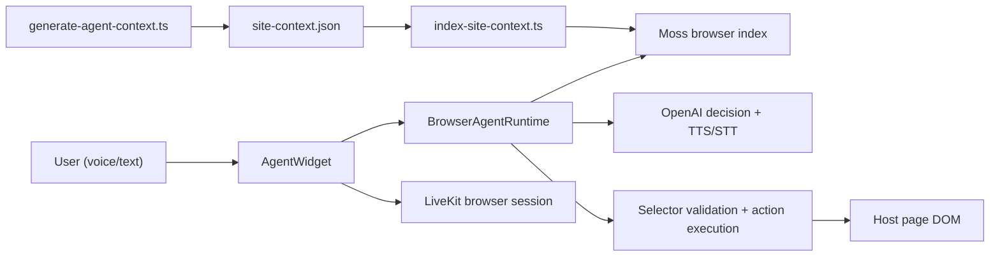

# Chalky

**Chalky** is a Moss-powered browser voice agent demo. It shows how to embed an AI guide into a real product site so users can ask questions in natural language, get grounded answers, and safely navigate across pages.

The app is built on a sample Moss marketing site (docs, integrations, dashboard) and demonstrates an **embeddable agent SDK** pattern: annotate UI with stable selectors, index site context into Moss, mount one global widget, and let the agent retrieve + act with confirmation gates.

Repository: [github.com/vivek100/chalky](https://github.com/vivek100/chalky)

## What this demonstrates

Most chatbots only answer questions. Chalky goes further:

- **Understands where the user is** — current route, visible sections, and annotated UI affordances
- **Retrieves grounded context** — Moss semantic search over page text, selectors, and route-level navigation docs
- **Guides across pages** — "show me API keys" can route to `/dashboard/api-keys` even from another page
- **Acts safely** — the model proposes actions; the runtime validates selectors and requires approval for risky clicks
- **Works by voice or text** — floating widget with LiveKit mic transport, OpenAI transcription/TTS, and a text fallback

The core product idea behind this repo is a **semantic context + runtime layer** for agent-capable apps. Voice is one interface; the same layer could power onboarding, docs assistants, command palettes, and in-app copilots.

## Architecture



### Layers

| Layer | Responsibility |
| --- | --- |
| **Host site** | Next.js app with `data-agent-id` on links/buttons and mirrored Moss docs |
| **Agent SDK** (`lib/agent-sdk`) | Floating widget, session persistence, voice UI, action approval |
| **Browser runtime** | Moss query, OpenAI structured decision, action proposal |
| **Context pipeline** | Playwright crawler → JSON docs → Moss index |
| **Safety contract** | Never execute raw selectors from model output; validate visibility, uniqueness, and risk level |

## Tech stack

- **Next.js 15** + React 19 + Tailwind
- **[@moss-dev/moss](https://docs.moss.dev)** — local semantic retrieval in the browser
- **LiveKit** — browser voice session transport
- **OpenAI** — agent decisions, speech-to-text, text-to-speech
- **Playwright** — site-wide context generation and selector verification

## Prerequisites

- Node.js 18+
- A [Moss](https://moss.dev) project (`MOSS_PROJECT_ID`, `MOSS_PROJECT_KEY`)
- OpenAI API key
- LiveKit URL + API key/secret

## Environment setup

Copy the example env file and fill in your credentials:

```powershell
Copy-Item .env.example .env.local
```

Required variables:

```env
MOSS_PROJECT_ID=
MOSS_PROJECT_KEY=
MOSS_INDEX_NAME=moss-demo-site

OPENAI_API_KEY=
OPENAI_MODEL=gpt-4.1-mini

LIVEKIT_URL=
LIVEKIT_API_KEY=
LIVEKIT_API_SECRET=
```

For local prototyping, `next.config.mjs` also exposes these as `NEXT_PUBLIC_UNSAFE_*` values so the browser SDK can read them. **Do not ship production apps with secrets in client-side env vars.**

## Quick start

```powershell
npm install
npm run build
npm run start
```

Open [http://127.0.0.1:3000/integrations](http://127.0.0.1:3000/integrations) and use the floating **Talk to us** pill.

To run on port 3010 (used by context scripts):

```powershell
npx next start -p 3010 -H 127.0.0.1
```

## Site context pipeline

Chalky indexes the **entire site**, not just the landing page. The pipeline:

1. **Discover routes** from `lib/agent-routes.ts` (integrations, dashboard, docs manifest)
2. **Crawl each route** with Playwright and extract:
   - page text chunks
   - selector/action chunks from `data-agent-id` elements
   - route-level navigation docs (`page_route` type) for cross-page movement
3. **Write context JSON** to `content/agent-context/site-context.json` and `public/agent-context/site-context.json`
4. **Upsert into Moss** as the `moss-demo-site` index
5. **Verify selectors** against a running app

### Commands

```powershell
# 1. Start the app first (scripts crawl a live server)
$env:BASE_URL = "http://127.0.0.1:3010"
npx next start -p 3010 -H 127.0.0.1

# 2. Generate site context (4k+ docs including route records)
npm run moss:generate-site-context

# 3. Index into Moss
npm run moss:index-site

# 4. Verify every selector resolves to exactly one visible element
$env:BASE_URL = "http://127.0.0.1:3010"
npm run verify:agent-context
```

Legacy landing-only scripts are still available:

```powershell
npm run moss:index-landing
$env:BASE_URL = "http://127.0.0.1:3000"
npm run verify:landing-selectors
```

## SDK integration

Mount the agent once in your root layout:

```tsx
import { AgentWidget } from "@/lib/agent-sdk";

<AgentWidget
  appId="moss-browser-agent-demo"
  indexName="moss-demo-site"
  contextUrl="/agent-context/site-context.json"
  pageId="site"
/>
```

### SDK modules

```text
lib/agent-sdk/
  AgentWidget.tsx          # Floating voice pill, transcript, approval UI
  BrowserAgentRuntime.ts   # Moss search + OpenAI decision + action proposal
  LiveKitVoiceSession.ts   # Browser LiveKit connection and mic publishing
  index.ts                 # Public exports
```

### Host site requirements

1. Add `data-agent-id` to important links, buttons, and sections
2. Generate and index page context into Moss
3. Mount `<AgentWidget />` globally (or per-section)

See [SDK_PLAN.md](./SDK_PLAN.md) for the longer-term extraction plan (ActionExecutor, SessionStore, ContextClient modules).

## Safety contract

The agent **never executes Moss results blindly**.

Before any DOM action, the runtime checks:

- selector exists in indexed context
- selector matches exactly one element
- element is visible and enabled
- `confirm` actions pause for user approval
- `blocked` actions never execute

Risk ladder:

```text
safe    → scroll, highlight, explain
guided  → navigate, focus
confirm → click submit/create/save (requires approval)
blocked → delete, publish, pay, irreversible actions
```

## App routes

| Route | Purpose |
| --- | --- |
| `/integrations` | Integration hub |
| `/integrations/livekit` | LiveKit integration detail |
| `/integrations/vapi` | VAPI integration detail |
| `/integrations/langchain` | LangChain integration detail |
| `/docs` | Mirrored Moss documentation |
| `/dashboard` | Sample product dashboard |
| `/dashboard/api-keys` | API key management demo |
| `/demo` | Guided walkthroughs |

## NPM scripts

| Script | Description |
| --- | --- |
| `dev` | Start Next.js dev server |
| `build` | Production build |
| `start` | Start production server |
| `fetch-docs` | Refresh mirrored docs from moss.dev |
| `moss:generate-site-context` | Crawl all routes and build context JSON |
| `moss:index-site` | Upsert site context into Moss |
| `moss:index-landing` | Index landing page only (legacy) |
| `verify:agent-context` | Playwright selector verification for full site |
| `verify:landing-selectors` | Landing page selector verification |

## How a request flows

1. User speaks or types a question
2. Widget loads the Moss index in-browser (`@moss-dev/moss-web`)
3. Runtime queries Moss for relevant page text, selectors, and route docs
4. OpenAI returns a natural reply plus an optional structured action (`navigate`, `click`, `focus`)
5. Runtime validates the proposed selector/target route
6. Safe actions execute immediately; `confirm` actions show an approval UI
7. Session state persists in `localStorage` across page navigation

Example queries that work after indexing:

- "show me API keys dashboard"
- "open pricing docs"
- "where is the LiveKit voice agent documentation"

## Project context

Chalky started from the [moss-demo-mock](https://github.com/ali-amjad52114/moss-demo-mock) sample site and evolved into an SDK-style demo:

- Flattened the nested `mock/` folder into a clean repo root
- Refactored the browser agent into `lib/agent-sdk`
- Added site-wide context generation with 4,000+ Moss documents
- Added first-class `page_route` docs so navigation does not depend on the current page's visible selectors

The broader vision (documented in planning notes) is a **context schema + runtime state + safe action router** that makes any web app agent-capable — with Moss as the retrieval engine and structured JSON as the product API.

## License

MIT (demo project)
