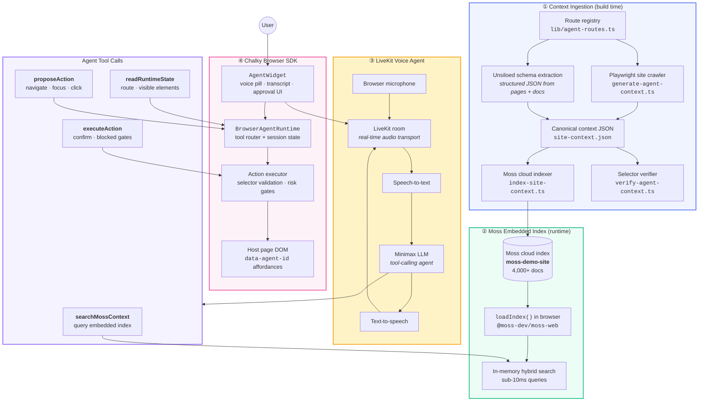

# Chalky

**Chalky** is a browser-resident agent SDK that turns any product site into a voice-guided experience. It combines three ideas:

1. **Structured context ingestion** — crawl pages, extract affordances, and project them into a Moss index
2. **Embedded Moss retrieval** — load indexes in-browser for sub-10ms semantic search during live sessions
3. **LiveKit voice agent loop** — STT → Minimax LLM with tool calls → Moss search → safe DOM actions → TTS

The SDK lives in `lib/agent-sdk`. Host apps annotate UI, run the ingestion pipeline once, mount `<AgentWidget />`, and the agent can answer questions, navigate across pages, and act on validated selectors.

Repository: [github.com/vivek100/chalky](https://github.com/vivek100/chalky)

---

## Architecture



### Design principle

The agent **lives in the browser** for speed where it matters — Moss search, DOM reads, selector validation, navigation, and session resume all happen locally. The voice loop (STT, reasoning, TTS) runs through **LiveKit + Minimax**, with tool calls bridging the LLM back to the embedded Moss index and the page runtime.

Moss is the **retrieval engine**. Chalky owns the **policy layer** — which indexes to search, which document wins, whether an action is allowed, and whether the user must confirm.

---

## The Chalky SDK

Chalky is not a page-level chatbot component. It is an **embeddable SDK** any site can install.

```tsx
// app/layout.tsx — mount once, works on every route
import { AgentWidget } from "@/lib/agent-sdk";

<AgentWidget
  appId="moss-browser-agent-demo"
  indexName="moss-demo-site"
  contextUrl="/agent-context/site-context.json"
  pageId="site"
/>
```

### SDK modules

| Module | Role |
| --- | --- |
| `AgentWidget` | Floating voice pill, LiveKit mic session, transcript panel, confirmation UI |
| `BrowserAgentRuntime` | Boots Moss in-browser, routes tool calls, proposes actions from search results |
| `LiveKitVoiceSession` | Browser LiveKit room client — publishes microphone track for real-time voice |
| `index.ts` | Public SDK surface for host apps |

### What host apps provide

```html
<!-- Stable affordance IDs — the source of truth for safe actions -->
<button data-agent-id="create-api-key-button">Create API Key</button>
<a data-agent-id="nav-pricing" href="/docs/pricing">Pricing</a>
```

```powershell
# One-time context pipeline
npm run moss:generate-site-context
npm run moss:index-site
npm run verify:agent-context
```

---

## Context ingestion

Chalky builds agent context through a **hybrid ingestion pipeline** — not hand-written docs alone.

```txt
Raw app + docs
      ↓
Route registry (static routes, integrations, docs manifest, dashboard)
      ↓
Playwright crawler ──────────────┐
  · page text chunks             ├──► Canonical JSON (site-context.json)
  · selector/action affordances  │
  · route navigation records       │
      ↓                            │
Unsiloed schema extraction ──────┘
  · structured page purpose, targets, tasks
  · confidence-scored draft context from rendered DOM + docs
      ↓
Playwright selector verification (every selector → exactly one visible element)
      ↓
Moss cloud upsert → browser loadIndex at runtime
```

**Why Unsiloed?** Raw pages and docs are messy. [Unsiloed](https://docs.unsiloed.ai/) provides schema-driven extraction into structured JSON with citations and confidence scores. Chalky uses it to bootstrap page purpose, target candidates, and task drafts. Developer-annotated `data-agent-id` values remain the **production source of truth** for executable actions; Unsiloed output is validated, not trusted blindly.

**Why Playwright?** The crawler visits every registered route, extracts visible DOM affordances, generates stable selectors (preferring `data-agent-id` → `id` → `aria-label` → `href` → DOM path), and writes retrieval-optimized Moss documents.

---

## Moss index design

Chalky stores one app-wide index (`moss-demo-site`) with **typed documents**. Each doc has searchable `text` plus structured `metadata` the agent uses for tool routing and safety.

### Document types

| `metadata.type` | Purpose | Example metadata |
| --- | --- | --- |
| `page_text` | What a page is about — headings, paragraphs, labels | `route`, `pageId`, `title`, `source` |
| `page_element` | An actionable UI affordance on a specific page | `selector`, `action`, `safety`, `label`, `targetRoute` |
| `page_route` | Cross-page navigation — works even when the target selector is not visible on the current page | `targetRoute`, `action: navigate`, `safety: safe` |

### Example documents

**Page route** (navigation without depending on current-page selectors):

```json
{
  "id": "route:/dashboard/api-keys",
  "text": "API Keys page. Route: /dashboard/api-keys. Use when the user asks to open, view, or manage API keys.",
  "metadata": {
    "type": "page_route",
    "targetRoute": "/dashboard/api-keys",
    "action": "navigate",
    "safety": "safe",
    "label": "API Keys"
  }
}
```

**Page element** (selector-backed action):

```json
{
  "id": "element:/integrations:0:nav-livekit",
  "text": "LiveKit integration card. Navigates to /integrations/livekit. Page: Integrations.",
  "metadata": {
    "type": "page_element",
    "selector": "[data-agent-id='integration-livekit']",
    "action": "navigate",
    "safety": "safe",
    "targetRoute": "/integrations/livekit"
  }
}
```

### Index scale

After a full site crawl, the index contains **4,000+ documents** across:

- 100+ routes (integrations, dashboard, mirrored Moss docs)
- Page text chunks per route
- Selector/action affordances per page
- One `page_route` record per registered route

### Retrieval strategy

The agent does not search Moss blindly. `BrowserAgentRuntime` implements a **search policy**:

```txt
1. Load index in-browser (loadIndex → in-memory, sub-10ms)
2. Query with user intent + optional metadata filters (type, route, pageId)
3. Merge Moss scores with local canonical JSON (contextUrl fallback)
4. Rank: page_route for navigation intent > page_element on current route > page_text for Q&A
5. Never execute a selector the runtime has not validated
```

Future multi-index support follows the same tool contract:

```txt
session:{sessionId}   → conversation memory, pending handoffs
page:{appId}:{pageId} → current page affordances
app:{appId}           → global site index (what Chalky ships today)
```

---

## LiveKit + Minimax agent loop

The voice agent runs a standard tool-calling loop over a LiveKit audio session:

```txt
User speaks
  → LiveKit room (browser mic published)
  → STT (speech-to-text)
  → Minimax LLM (reasoning + tool selection)
  → Tool calls (searchMossContext, readRuntimeState, proposeAction)
  → Moss embedded search (sub-10ms, in-browser)
  → Action proposal returned to browser SDK
  → Runtime validates selector / route / safety level
  → User confirms if required
  → DOM action executes (navigate, focus, click)
  → Minimax generates spoken reply
  → TTS → LiveKit → user hears response
```

**LiveKit** handles real-time audio transport — the browser joins a room, publishes the microphone track, and maintains a low-latency voice channel. The agent brain connects to the same room as a participant.

**Minimax** powers the LLM agent — intent resolution, natural replies, and structured tool-call decisions. The model never invents selectors or routes; it picks from Moss search results returned by `searchMossContext`.

---

## Agent tool calls

The Minimax agent interacts with the page through four SDK tools. The runtime enforces policy; the model only proposes.

### `searchMossContext`

Semantic search over the embedded Moss index.

```ts
searchMossContext({
  query: "show me API keys dashboard",
  indexName: "moss-demo-site",
  filters: { type: ["page_route", "page_element", "page_text"] },
  topK: 6
})
// → ranked docs with id, text, metadata, score
```

Implemented in `BrowserAgentRuntime.search()` — calls `client.query()` on the in-browser Moss client after `loadIndex()`.

### `readRuntimeState`

Reads the live page snapshot without guessing from the DOM.

```ts
readRuntimeState()
// → { route, pageTitle, visibleElements: [{ agentId, tag, label, href, disabled }] }
```

Scans `[data-agent-id]` elements, filters to visible/enabled, caps at 40 affordances. Passed to the LLM alongside Moss results so decisions are grounded in what the user actually sees.

### `proposeAction`

Maps a Moss document to a structured action proposal.

```ts
proposeAction({ docId, actionOverride? })
// → { docId, label, selector?, action, safety, targetRoute?, reason }
```

Rules:
- `page_route` docs → `navigate` to `targetRoute` (safety: `safe`)
- `page_element` docs → `click` / `focus` / `navigate` based on metadata
- Model picks `docId` from search results — never invents selectors

### `executeAction`

Validates and executes a proposed action in the browser.

```ts
executeAction({ proposal })
// checks: selector exists · matches exactly one element · visible · enabled
// safety: safe → execute · confirm → approval UI · blocked → reject
```

The approval UI in `AgentWidget` handles `confirm`-level actions. Cancel clears the pending command; approve runs the DOM action.

---

## Safety contract

```txt
safe     → navigate, explain, highlight          (auto-execute)
guided   → focus, scroll                         (auto-execute)
confirm  → click submit, create, save            (user approval required)
blocked  → delete, publish, pay, irreversible    (never execute)
```

The agent **never executes raw Moss text or model-invented selectors**. Every action passes through:

1. Moss document must have structured metadata (`type`, `selector` or `targetRoute`)
2. Selector must resolve to exactly one visible, enabled element
3. Safety level must permit execution (or trigger confirmation UI)
4. Cross-page navigation uses `page_route` docs, not fragile current-page link ranking

---

## Tech stack

| Layer | Technology |
| --- | --- |
| Host app | Next.js 15, React 19, Tailwind |
| Agent SDK | `lib/agent-sdk` (TypeScript, browser-resident) |
| Retrieval | [@moss-dev/moss](https://docs.moss.dev) + [@moss-dev/moss-web](https://docs.moss.dev) (embedded in-browser) |
| Voice transport | [LiveKit](https://docs.livekit.io/agents/) (browser room client) |
| LLM agent | [Minimax](https://www.minimax.io/) (tool-calling, structured decisions) |
| Context ingestion | Playwright crawler + [Unsiloed](https://docs.unsiloed.ai/) schema extraction |
| Verification | Playwright selector verifier |

---

## Quick start

### Prerequisites

- Node.js 18+
- Moss project credentials
- Minimax API key
- LiveKit URL + API key/secret

### Setup

```powershell
git clone https://github.com/vivek100/chalky.git
cd chalky
npm install
Copy-Item .env.example .env.local
# Fill in MOSS_*, MINIMAX_*, LIVEKIT_* values
```

```env
MOSS_PROJECT_ID=
MOSS_PROJECT_KEY=
MOSS_INDEX_NAME=moss-demo-site

MINIMAX_API_KEY=
MINIMAX_MODEL=abab6.5-chat

LIVEKIT_URL=
LIVEKIT_API_KEY=
LIVEKIT_API_SECRET=
```

### Build the Moss index

```powershell
# Terminal 1 — serve the app (crawler needs a live server)
$env:BASE_URL = "http://127.0.0.1:3010"
npx next start -p 3010 -H 127.0.0.1

# Terminal 2 — ingest + index + verify
npm run moss:generate-site-context
npm run moss:index-site
$env:BASE_URL = "http://127.0.0.1:3010"
npm run verify:agent-context
```

### Run

```powershell
npm run build
npm run start
```

Open [http://127.0.0.1:3000/integrations](http://127.0.0.1:3000/integrations) and tap **Talk to us**.

### Try these queries

- "show me API keys dashboard"
- "open pricing docs"
- "where is the LiveKit voice agent documentation"
- "take me to the demo walkthroughs"

---

## App routes

| Route | Purpose |
| --- | --- |
| `/integrations` | Integration hub |
| `/integrations/livekit` | LiveKit voice agent docs |
| `/integrations/vapi` | VAPI integration |
| `/integrations/langchain` | LangChain integration |
| `/docs` | Mirrored Moss documentation (100+ pages) |
| `/dashboard` | Sample product dashboard |
| `/dashboard/api-keys` | API key management |
| `/demo` | Guided walkthroughs |

---

## NPM scripts

| Script | Description |
| --- | --- |
| `moss:generate-site-context` | Crawl all routes → canonical JSON (4k+ docs) |
| `moss:index-site` | Upsert context into Moss cloud index |
| `moss:index-landing` | Index landing page only (legacy) |
| `verify:agent-context` | Playwright verification for full site |
| `verify:landing-selectors` | Landing page selector check |
| `fetch-docs` | Refresh mirrored docs from moss.dev |
| `dev` / `build` / `start` | Standard Next.js lifecycle |

---

## Project lineage

Chalky evolved from the [moss-demo-mock](https://github.com/ali-amjad52114/moss-demo-mock) sample site into a standalone SDK demo:

- Flattened repo structure (no nested `mock/` folder)
- Extracted `lib/agent-sdk` as an embeddable library
- Site-wide Moss index with typed documents and `page_route` navigation records
- Playwright-verified selector pipeline for production-grade action accuracy

The broader vision: a **context schema + embedded Moss retrieval + safe action router** that makes any web app agent-capable — voice, chat, onboarding, and copilots all reuse the same index and SDK.

See [SDK_PLAN.md](./SDK_PLAN.md) for the module extraction roadmap (`ActionExecutor`, `SessionStore`, `ContextClient`).

---

## License

MIT
